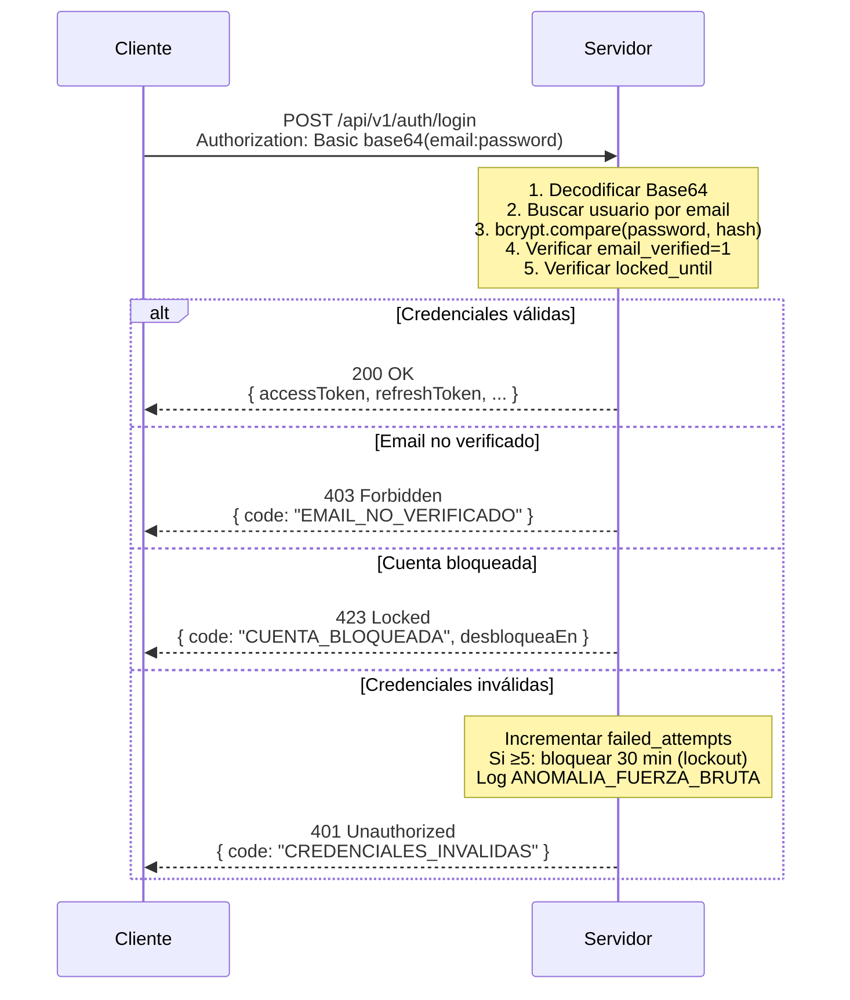

# HTTP Basic Authentication (RFC 7617)

## Vulnerabilidades y Mitigaciones

| Vulnerabilidad | Mitigación implementada |
|---|---|
| Credenciales en Base64 (reversible) | Solo válido sobre HTTPS |
| Timing attack en comparación | `bcrypt.compare` es inherentemente constant-time |
| Brute force | Lockout tras 5 intentos, 30 min |
| Credential stuffing | Detección de anomalías: >10 IPs distintas en 5 min |
| Enumeración de usuarios | Mismo mensaje de error para usuario no encontrado y password incorrecto |
