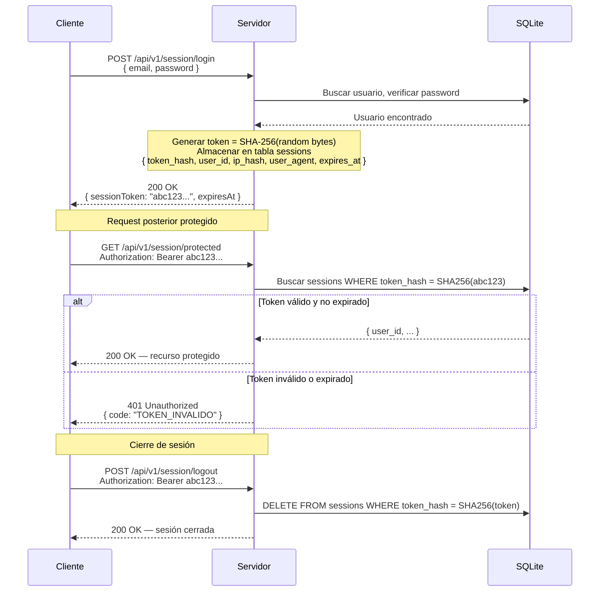

# Session Token (Stateful)

## Características

- **Stateful**: el servidor guarda cada sesión en BD
- **Revocación instantánea**: borrar de BD invalida inmediatamente
- **ip_hash**: nunca se guarda la IP en claro (GDPR)
- **SHA-256** del token — nunca el token en claro en BD
- Expira tras inactividad (TTL configurable)
