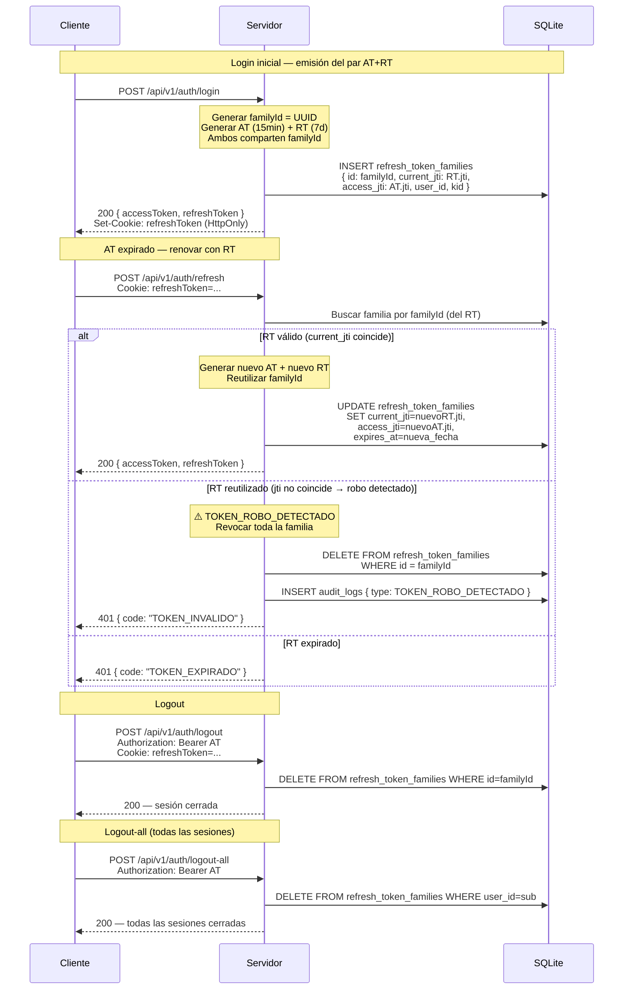

# JWT con Family Tracking y Refresh Token Rotation

## Por Qué Family Tracking

El **Refresh Token Rotation** estándar no detecta el robo si el atacante usa el RT
antes que el usuario legítimo. El Family Tracking agrega:

1. El RT tiene un `familyId` que agrupa AT + RT emitidos juntos.
2. Al renovar, solo se acepta el RT con `jti == current_jti` de la familia.
3. Si alguien presenta un RT con `jti` diferente (el RT antiguo robado), la familia **entera** se revoca.
4. El usuario legítimo queda sin sesión — molestia mínima vs seguridad máxima.

## Protección contra Race Conditions

La actualización de `current_jti` se hace en una **transacción SQLite** (`db.transaction()`).
Una segunda llamada concurrente con el mismo RT ve el `jti` ya actualizado y recibe 401.
