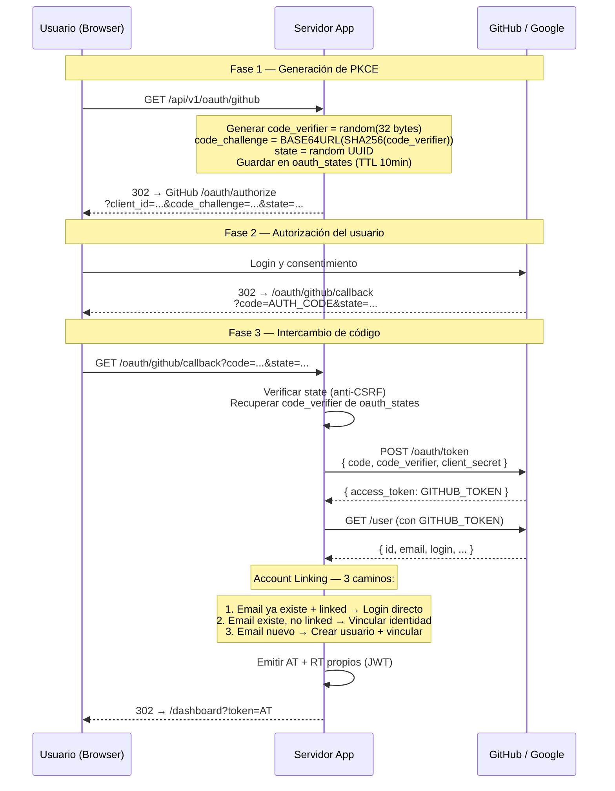

# OAuth 2.0 Authorization Code + PKCE (GitHub / Google)

## PKCE — Por Qué Es Necesario

Sin PKCE, un atacante que intercepte el `AUTH_CODE` puede canjearlo por tokens
(especialmente en apps móviles/SPA donde el `client_secret` no se puede guardar de forma segura).

Con PKCE:
1. Solo quien generó el `code_verifier` puede completar el intercambio.
2. El `code_challenge` (derivado públicamente) no permite reconstruir el `code_verifier`.
3. El `state` previene ataques CSRF.
