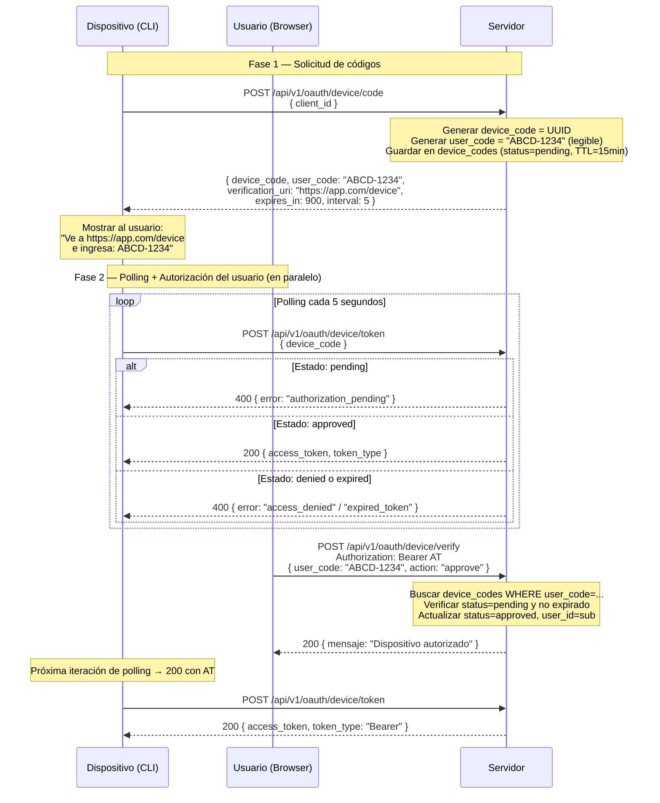

# OAuth 2.0 Device Authorization Grant (RFC 8628)

Diseñado para dispositivos sin navegador o teclado (Smart TVs, CLIs, IoT).

## Caso de Uso

- CLI tools que necesitan autenticar al usuario sin abrir un navegador automáticamente
- Smart TVs / consolas de videojuegos
- Dispositivos IoT con pantalla limitada
