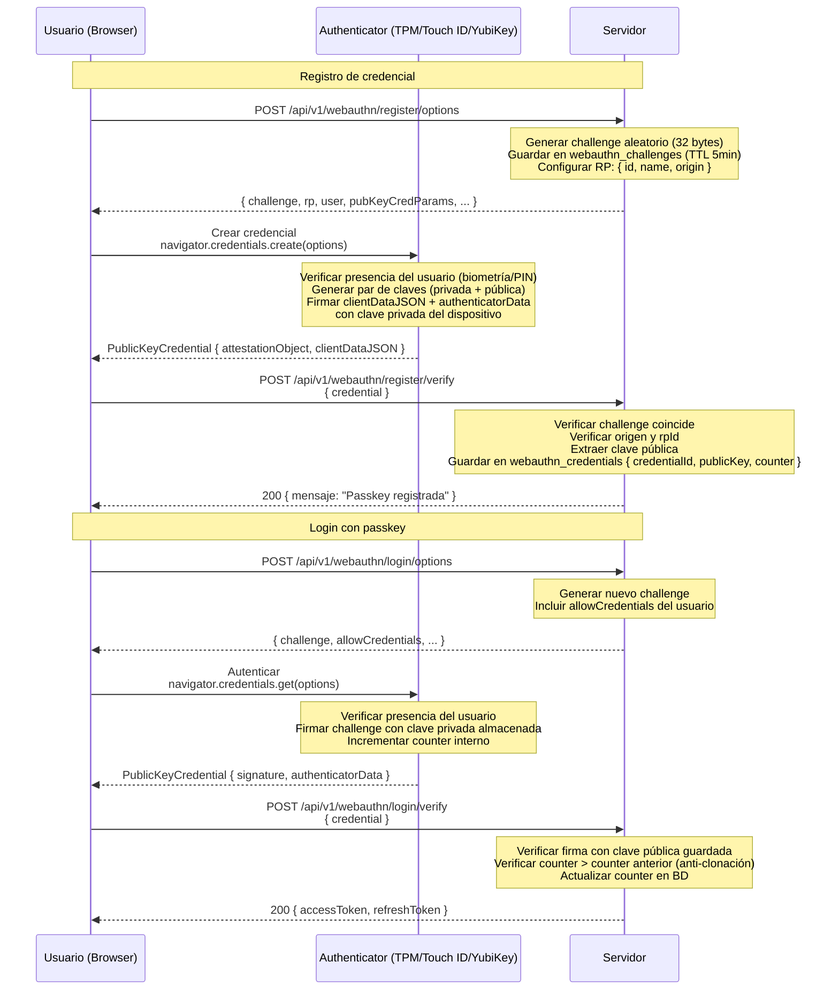

# WebAuthn / Passkeys (FIDO2)

## Seguridad

- **Phishing-resistant**: la clave está vinculada a `rpId` (dominio). Un sitio de phishing obtendría una aserción para su dominio, no el legítimo.
- **No hay secreto compartido**: el servidor nunca ve la clave privada.
- **Counter anti-clonación**: si el counter retrocede o no avanza, hay una clave clonada.
- **Presencia del usuario**: el authenticator requiere acción física (biometría, PIN, toque).
