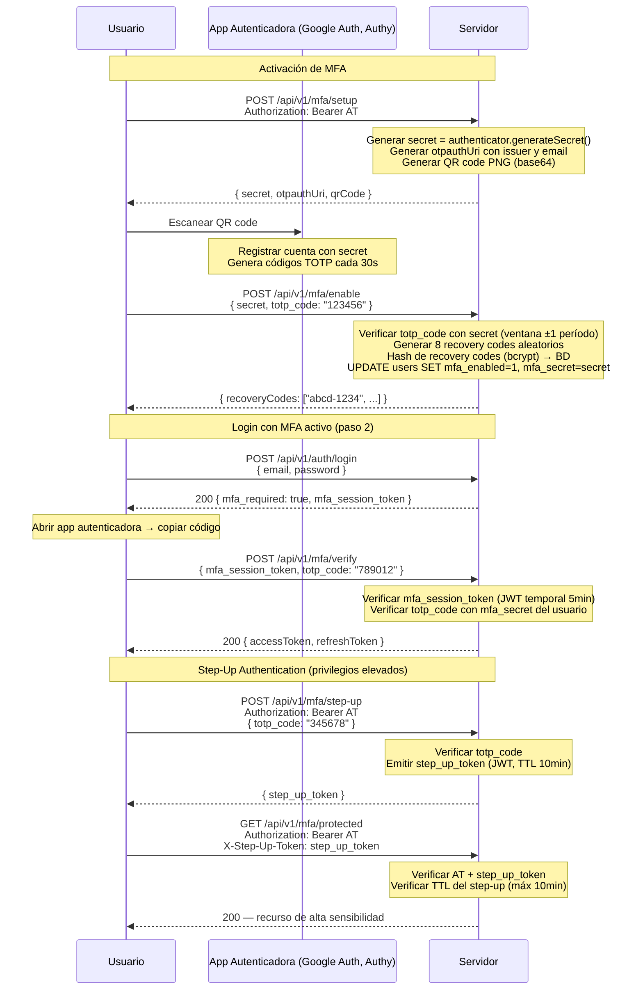

# TOTP / MFA — Autenticación en Dos Factores (RFC 6238)

## Recovery Codes

- Se generan **8 códigos** al activar MFA.
- Cada código es de **un solo uso**: tras usarlo se marca como `used_at`.
- Se almacenan con **bcrypt** (nunca en claro).
- Si el usuario pierde el dispositivo, puede recuperar acceso con un recovery code.
