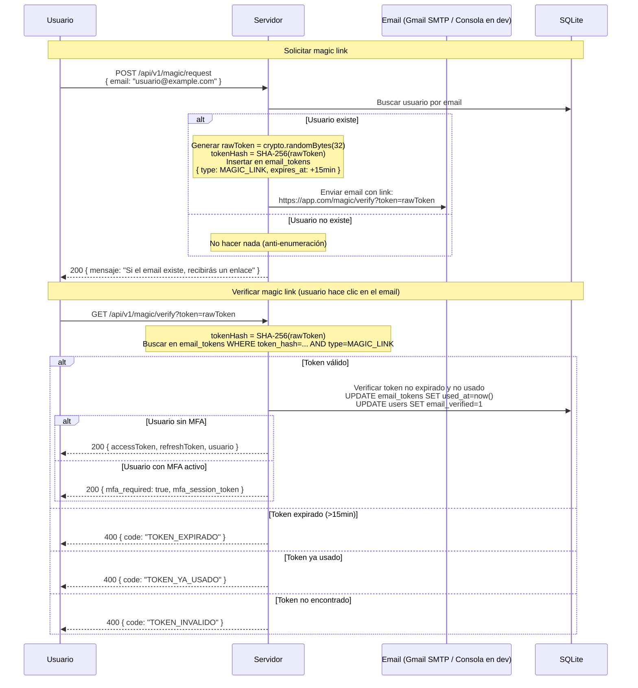

# Magic Link — Passwordless Authentication

## Ventajas del Magic Link

- **Sin contraseña**: elimina el riesgo de contraseñas débiles o reutilizadas.
- **Email como segundo factor implícito**: quien controla el email, controla la cuenta.
- **Anti-enumeración**: la respuesta es idéntica exista o no el email.
- **Un solo uso**: el token se marca como `used_at` al verificarse.
- **TTL corto (15 min)**: ventana de ataque mínima.
- **SHA-256 en BD**: el token en claro nunca se almacena.
