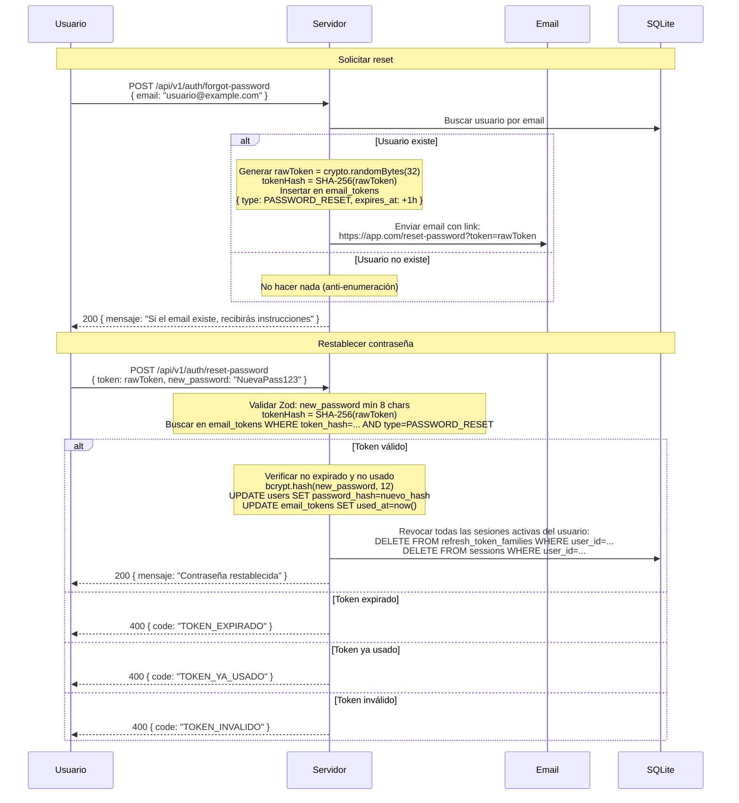

# Password Reset por Email

## Seguridad del Flujo

- **Anti-enumeración**: misma respuesta 200 exista o no el email.
- **TTL de 1 hora**: ventana limitada para el atacante.
- **Un solo uso**: no se puede reutilizar el mismo link.
- **SHA-256 en BD**: token en claro nunca almacenado.
- **Revocación de sesiones**: al cambiar la contraseña, todas las sesiones previas quedan invalidadas — el atacante que tenía un RT queda expulsado.
- **bcrypt cost=12**: hash robusto de la nueva contraseña.
