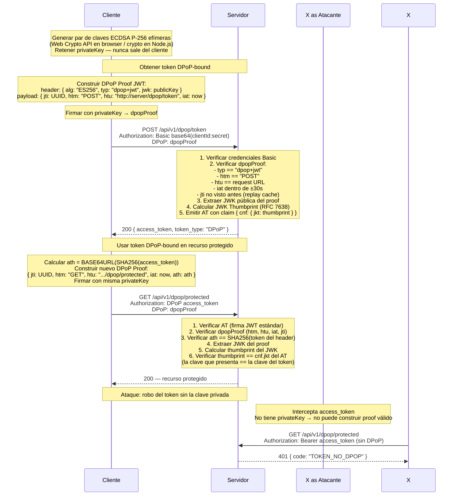

# DPoP — Sender-Constrained Tokens (RFC 9449)

## Por Qué DPoP es Superior a Bearer

| | Bearer Token | DPoP Token |
|---|---|---|
| Token robado | Atacante puede usarlo directamente | Inútil sin la clave privada |
| Replay de proof | N/A | Bloqueado por jti cache (TTL 60s) |
| Vinculación a cliente | Ninguna | `cnf.jkt` en AT = thumbprint de la clave |
| Complejidad | Baja | Media (requiere firma por request) |
| Adopción | Universal | OAuth 2.1 lo recomienda |

## Prevención de Replay

Cada DPoP Proof tiene un `jti` único. El servidor mantiene un cache en memoria
(`Map<jti, expiresAt>`) con TTL de 60 segundos. El mismo proof no puede usarse
dos veces dentro de esa ventana.
